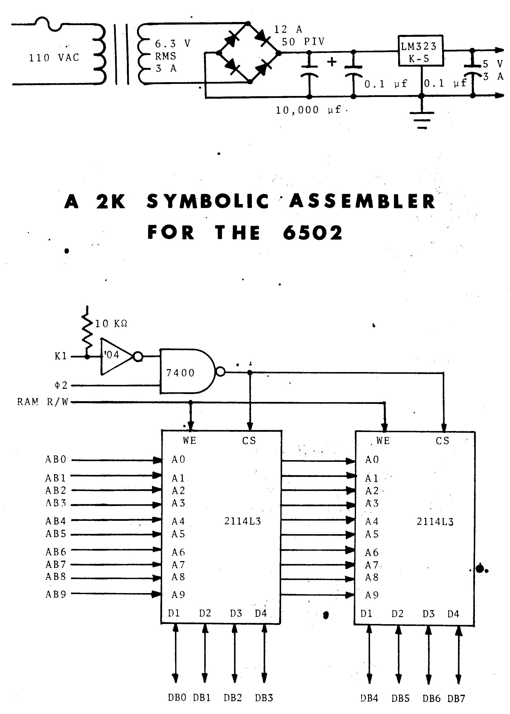

# A 2K SYMBOLIC ASSEMBLER FOR THE 6502

Copyright 1979  
by Robert Ford Denison  
RD5 Teeter Rd.  
Ithaca, NY 14850  

All rights reserved, including the right to reproduce the
program or documentation in machine-readable form, including
magnetic media and read-only-memory.

*Cover:* Schematics for a 5V, 3A regulated power supply and a
1k x 8 read/write memory block. The power supply and three
such memory blocks can be added to the basic KIM-1 microcomputer
to provide the 4K RAM required by this assembler. Parts are
available from Jameco Electronics.

## TABLE OF CONTENTS

- [INTRODUCTION](#introduction)
- [USE OF THE ASSMEBLER](#use-of-the-assembler)
  - [Basic Concepts](#basic-concepts)
  - [Control Mode](#control-mode)
  - [Assembly Language Format](#assembly-language-format)
  - [Edit Mode Commands](#edit-mode-commands)
  - [Programming Restrictions](#programming-restrictions)
  - [Sample Run](#sample-run)
  - [Structured Programming](#structured-programming)
- [LISTING](#listing)
- [THEORY OF OPERATIONS](#theory-of-operation)
  - [Encoding Scheme](#encoding-scheme)
  - [Useful Subroutines](#useful-subroutines)
- [MODIFICATION](#modification)
  - [Changing Special Key Definitions](#changing-special-key-definitions)
  - [Moving Tables](#moving-tables)
  - [Adding Custom Commands](#adding-custom-commands)
  - [Relocation](#relocation)
  - [I/O Requirements](#io-requirements)

- [APPENDIX A: AN INEXPENSIVE I/O SYSTEM](#appendix-a-an-inexpensive-io-system)
- [APPENDIX B: ANSWERS TO USER QUESTIONS](#appendix-b-answers-to-user-questions)

- [2K SYMBOLIC ASSEMBLER: REVISIONS](#2k-symbolic-assembler-revisions)

### TABLES

- [2.1](#table-2-1) Input Format for Commands and Instructions
- [2.2](#table-2-2) Error Codes
- [4.1](#table-4-1) Important Arrays and Pointers
- [4.2](#table-4-2) Global Symbols on Page Zero
- [4.3](#table-4-3) Other Global Symbols
- [4.4](#table-4-4) Hierarchy of Modules
- [5.1](#table-5-1) I/O Routines

### FIGURES

- [A.1](#figure-a-1) Keyboard Interface

## INTRODUCTION

Microcomputers based on the powerful 6502 microprocessor
are becoming increasingly widespread. Business, educational,
and word-processing applications generally require expensive
disk-based systems running high level languages such as BASIC
or Pascal. Inexpensive 6502 systems have mainly been limited
to such trivial uses as games, checkbook balancing, and recipe
files. Games may, of course, be used for the nontrivial purpose
of learning about microcomputers.

Inexpensive systems may, however, be more than adequate for
quite sophisticated applications in the field of process control
and data acquisition. A simple example is turning a tape
recorder on at a specified time to record a radio program.
Opening and closing insulated shutters to maximize solar heat
gain while minimizing heat loss is more challenging, but could
result in considerable savings. An example of a scientific
application is collecting data from temperature and pressure
sensors in a study of sap flow in sugar maples.

My own experience has been entirely with the MOS Technology
KIM-1, which is ideal for such applications. I first used it
to control an optical printer which was used to produce special
cinematic effects. More recently, my KIM-1 was part of a complex
gas analysis system for my research on nitrogen fixation
in soybeans.

Neither expensive computer hardware nor years of training
is necessary to attempt such projects. My system has only
4K RAM. I use a $30 software-scanned keyboard for input, and
use the KIM-1 display as an output device for both numbers and
letters. I learned most of what I know in this field from the
MOS Technology _Programming Manual_, Don Lancaster's _TTL Cookbook_,
BYTE magazine, and by trial and error.

The key to process control programming is the use of assembly
language. It is much faster than BASIC, and uses far less memory
than high level languages. In addition, most process control
problems can be solved more easily and directly in assembly
language than in a higher level language.

An assembler makes assembly language programming considerably
easier by taking over the time-consuming and error-prone
task of translating assembly language into machine language.
A true assembler, such as the one described herein, allows the
programmer to refer to variables, subroutines, and lines within
subroutines using descriptive names, rather than their addresses.

This assembler outperforms all other true assemblers for
the 6502 with which I am familiar, in terms of speed and memory
efficiency. It can assemble a 128 byte module in a fraction
of a second. Programs up to 1K bytes can be assembled ina
KIM-1 system with only 4K RAM, including 2K for the assembler
itself. I would appreciate being informed of any other symbolic
assembler which can match either of these claims.

I would like to thank Dr. H. R. Luxenberg, Professor of
Computer Science at the California State University at Chico
for modifying the assembler I/O for the SYM, and for
pointing out errors in the program and documentation. John
Geiger, of Milwaukee, found additional errors and kindly
relocated the assembler to start at address `2000`. Any errors
that remain are my responsibility, and I would appreciate having
them brought to my attention.

This book is dedicated to Mike Colyar, of the Evergreen
State College, who introduced me to electronics.

## USE OF THE ASSEMBLER

**System requirements.** The assembler requires a 650X-based
microcomputer with at least 4K RAM and an appropriate I/O device.
This documentation is based on a standard system: a KIM-1 with
3K RAM at address `0400` and a conventional computer terminal
connected to the serial interface. A second version is available
for KIM-1 systems with 4K RAM at address `2000`; addresses
in parentheses refer to that version.

**Other systems.** The assembler can be modified for use with
other systems by following the guidelines in Section 5. More
detailed instructions for specific systems will be made available
as demand warrants. SYM owners see Appendix B.

**Installing the assembler.** To install the assembler in the
standard system, load it from cassette or listing. Begin execution
at address `05B8` (`23B8`). The assembler will prompt with a
question mark, indicating that it is in control mode.

### Basic Concepts

**Modes.** The assembler operates in two modes. "Control"
mode allows control of the allocation of memory space, definition
of variables, and related functions. "Edit" mode is used
to actually enter, modify, and assemble modules.

**Modules.** A "module" is a subroutine or a segment of a
program or subroutine. Each use of edit mode corresponds to
one module. Modules are limited in length to 128 bytes, but
a program may contain many modules. Total program length is
limited only by available RAM.

**Module pointer.** Assembled modules are stored successively
in RAM under the control of the "module pointer." This pointer
is initialized to `0C80` (`2A80`). It is then incremented automatically
each time a module is stored, to prevent the module
from being overwritten by the next module. More information on
this and other pointers is given in [Table 4.1](#table-4-1).

**Symbols.** A "symbol" is a name given to a specific address.
It may refer to a variable, a table, a module, a line within a
module, or some other address such as an I/O port. Symbols may
be up to six characters in length.

**Global vs. local symbols.** "Global" symbols are defined in
control mode and may be referenced by any module. Symbols
defined in edit mode are "local" to the module in which they
were created and may not be referenced by other modules. Line
labels are local symbols, so two modules may use identical
line labels without confusion.

**Input format.** Input to the assembler must be in a specific
format. Each input line is divided into a series of "fields."
Each item must be left-justified in the correct field. In
practice this is quite easy, because the "space" bar has been
programmed to advance automatically to the beginning of the
next field each time it is pressed. It may also be used to
skip a field.

**Special key definitions.** Each line must be terminated with
a carriage return. A "null line" consists of a carriage return
only. "Backspace" may be used to correct errors within a given
field; more serious errors require use of the assembler's
editing capability. The "escape" key causes the assembler to
execute a `BRK` instruction, and may be used to return to the
system monitor. Users whose terminals lack any of the above
keys should refer to Section 5.1.

**Hexadecimal numbers.** The assembler uses hexadecimal (base
sixteen) numbers exclusively. All addresses in this documentation
are therefore given in hexadecimal. Blanks are read as
zeroes.

**Arrays.** An array is any variable, e.g. a table, that
occupies more than one byte. Arrays are limited to 255 bytes.
However, two or more arrays may be treated as one large array
if an array longer than 255 bytes is needed.

**Source vs. object code.** "Source code" refers to the assembly
language module. Assembly is the process of translating
source into "object," or machine language code.

### Control Mode

In this mode the user can define global symbols, allocate
space for tables, redefine the module pointer, and enter edit
mode to begin a new module. Control mode commands begin with
a question mark, which is also a prompt symbol for the mode.

Enter the command in the first field, followed by any
additional information required in subsequent fields. The
format for each command is given in [Table 2.1](#table-2-1) and illustrated
by example in Section 2.6.

**Define global symbols.** The `?ASSGN` command is used to assign
addresses to global symbols. A four-digit address is required.
Additional symbols may be defined without typing `?ASSGN` again.
Just hit the space bar to skip the first field; then enter the
symbol and its address. Enter a null line (carriage return)
when all symbols have been defined.

**Allocate space for tables.** Use the `?TABLE` command to
reserve space for tables. Enter the name of the table and its
length in bytes (two digits). The symbol is assigned the
current value of the module pointer as its address. The pointer
is then incremented by the length of the table to prevent overwrite
by the next table or module. Additional tables may be
defined in a manner similar to that for `?ASSGN`.

**Redefine the module pointer.** The `?REDEF` command may be
used with caution to change the value of the module pointer.
This might be done to allow assembled modules to be stored in
memory locations not ordinarily used for program storage. For
example, assembled modules might be stored on page zero or one
if space were at a premium.

**Begin new module.** The `?BEGIN` command causes the assembler
to enter edit mode to start a new module. The name of the
module is entered in the second field, and is added to the
symbol table as a global symbol. Its address is the current
value of the module pointer, since that is where the module
will be stored after it is assembled. The module name is also
the label for the first line in the module, unless another line
label is supplied.

### Assembly Language Format

In edit mode, the user inputs an assembly language module.
The module is edited and assembled using commands described in
Section 2.4. This process is illustrated in Section 2.6. The
prompt for edit mode is a hyphen, followed by the address where
the assembly language code for the line will be stored.

To enter a line of assembly language, hit the space bar to
skip over the first field. The contents of the other fields
are summarized in [Table 2.1](#table-2-1) and further explained below.

**Label.** Enter a symbol in the second field if the line will
be referenced by a branch instruction elsewhere in the module.
Otherwise hit the space bar again.

**Opcode.** This field must contain the mnemonic and address
mode for the desired instruction. The mnemonic is the standard
three-letter MOS Technology code, e.g. `LDA`. Absolute,
implied, and relative addressing require no additional information
in this field. The other address modes are indicated in
the opcode field by one or two characters immediately following
the mnemonic, e.g. `LDAZX`. These mode codes are
`#`, `Z`, `A`, `IX`, `IY`, `2X`, `X`, `Y`, `I`, and `ZY`
for immediate, zero page, accumulator, indexed
indirect X, indirect indexed Y, zero page X, absolute X, absolute
Y, indirect, and zero page Y addressing. Users who prefer `IM`
for immediate addressing need only change two bytes at `02AC`
(`20AC`) to `49,4D`.

**Operand.** For instructions that require no operand, hit
carriage return to end the line. Immediate addressing requires
a two-digit hexadecimal number in this field. Other address
modes use a symbol as their operand.


**Table 2.1**: <a name="table-2-1"></a> Input Format for Commands and Instructions

|                               | Field 1  | Field 2    | Field 3  | Field 4  | Field 5  |
| ----------------------------- | -------- | ---------- | -------- | -------- | -------- |
| Assign address to symbol.     | `?ASSGN` | symbol     | *nnnn*   |          |          |
| Reserve space for table.      | `?TABLE` | symbol     | *nn*     |          |          |
| Redefine module pointer.      | `?REDEF` | *nnnn*     |          |          |          |
| Begin new module.             | `?BEGIN` | symbol     |          |          |          |
|                               |          |            |          |          |          |
| One-byte instructions.        |          | (symbol)   | opcode   |          |          |
| Immediate mode instructions.  |          | (symbol)   | opcode   | *nn*     |          |
| Other two-byte instructions.  |          | (symbol)   | opcode   | symbol   |          |
| Three-byte instructions.      |          | (symbol)   | opcode   | symbol   | (*nn*)   |
|                               |          |            |          |          |          |
| Define local symbol.          | `-LOCAL` | symbol     | *nnnn*   |          |          |
| Assemble module.              | `-ASSEM` |            |          |          |          |
| Print lines in range.         | `-PRINT` |*nn*`TO`*nn*|          |          |          |
| insert before line given.     | `-INSRT` | *nn*       |          |          |          |
| Replace lines in range.       | `-INSRT` |*nn*`TO`*nn*|          |          |          |
| Append to end of module.      | `-INSRT` | `FF`       |          |          |          |
| Save module in RAM.           | `-STORE` |            |          |          |          |

&nbsp;&nbsp;&nbsp;&nbsp;&nbsp;&nbsp;( ) Optional.

&nbsp;&nbsp;&nbsp;&nbsp;&nbsp;&nbsp;*nn* Hexadecimal digits.

**Offset.** Three-byte instructions may use a two-digit hexadecimal
number in this field to indicate an offset from the
beginning of a table or array. This value is added to the base
address of the array on assembly. The offset is optional, and
may not be used with two-byte instructions.

### Edit Mode Commands

Commands are used in edit mode to define local symbols and
to assemble, list, edit, and save a module. Edit mode commands
begin with a hyphen. Their format is given in [Table 2.1](#table-2-1) and
their use is illustrated in Section 2.6.

**Define local symbols.** The `-LOCAL` command is identical to
`?ASSGN` except that the symbols defined are local to the module.

**Assemble.** The `-ASSEM` command translates the module into
machine language. The assembler will respond quickly with either
the normal address prompt, indicating successful assembly, or
with one or more undefined symbols. Use the `-LOCAL` command to
define these symbols before assembling again. Undefined global
symbols may be temporarily defined locally to allow assembly.

**List.** An assembled module may be listed using the `-PRINT`
command. Two line numbers must be supplied. The number of a
line consists of the two least significant digits of its address
prompt. `-PRINT` will list from the first line number up to, but
not including, the second line number. The module must be
reassembled before listing each time it is modified.

**Test.** The assembled module may be tested by hitting "reset"
to return to the system monitor. Check the module pointer at
`0040,41` to get the start address of the module. The module may
be tested using appropriate user or monitor routines. Then return
to edit mode by entering the assembler at `05D6` (`23D6`).
Correct any errors (using the `-INSRT` command) and reassemble.

**Insert lines.** The `-INSRT` command can be used to insert,
delete, or replace lines. To insert one or more lines, use
`-INSRT` with a line number. New lines are inserted starting at
that line number. The line previously at that address, and all
lines following it, are automatically moved forward to make room
for each new line.

**Delete or replace lines.** If a second line number is supplied
with the `-INSRT` command, the assembler will delete the lines in
the specified range. Lines following the deletion are moved back
to fill the resulting gap. New lines can then be inserted
starting at the first line number.

**Append new lines.** After inserting or deleting lines, the
user may wish to add lines to the end of the module. To do
this, type `-INSRT FF` (fast forward?). Ignore the resulting
error code.

**Save.** An assembled module is saved using the `-STORE` command.
The module length is added to the module pointer to prevent overwrite
by the next module. Memory space is conserved by clearing
local symbols from the symbol table. The assembler then returns
to control mode, allowing definition of new global symbols,
redefinition of the module pointer, or beginning a new module.

**Tape storage.** Either source or object code can be saved on
tape. Saving object code is easy since it only requires dumping
the area of memory which contains the code itself. Saving source
code requires saving both the symbol table and the module. This
is done by dumping `0A00-0C7F` (`2800-2A7F`). In addition, pointers
at the following locations must be saved: `003C`, `003D`, `0050`, `0051`,
`0056`. It is probably easiest just to make a note of these pointer
values, using the form at the end of this manual.

Retrieving modules from tape requires that the assembler
be initialized by running it normally from `05B8` (`23B8`). Then
hit "reset" to leave the assembler. Load the module from
tape, restore the pointer values, and enter the assembler at
`05D6` (`23D6`). Ignore any error message on re-entry.

Note that the previous contents of the symbol table are destroyed
by this process, so that some global symbols may have to
be redefined if the module is loaded for use with a new program.
The assembled module will be stored according to the value of
the module pointer before the module was loaded. This may not
correspond to its previous location. `?REDEF` may be used to store
the assembled location wherever desired.

Saving and retrieving assembly language modules is a tricky
process which requires experience to master. It may be easier
to debug the module thoroughly and save the object code.

### Programming Restrictions

The assembler is reasonably immune to user error, other than
careless use of the `?REDEF` command. Each input line is checked
for correctness; when an error is detected, the normal prompt
symbol is replaced with an error code ([Table 2.2](#table-2-2)). The restrictions
below are designed to eliminate errors at assembly time
(other than undefined symbols) and to minimize debugging time.

**Commands.** Commands may be used at any time, but the result
may be order-dependent. For example, `?TABLE` will reserve space
in a different place if used after `?REDEF`. However, `?ASSGN` uses
absolute addresses and is unaffected by `?REDEF`.

**Module length.** Module length is limited to 128 bytes.
This guarantees that relative branches within a module will be
within range. It also requires that programs be broken up into
short modules which can be debugged more easily. A module
listing will generally fit on one page. The length of a module
corresponds to the two rightmost digits in the address prompt.
Total program length is limited by available RAM.

**Relative branches.** Relative branches are allowed only
within a module, for the reason given above. Line labels may
only be referenced by relative branches; this greatly simplifies
relocation.

**Symbols.** All symbols referenced in a module must be defined
before assembly. This normally requires that subroutines be
assembled and stored before they are referenced by a program or
another subroutine. However, they could be assigned an address
using `?ASSGN` or `-LOCAL`, and entered later. Zero page symbols
must be defined before the first line in which they are referenced.

**Other restrictions.** Symbol table length is limited to 64
symbols. No offset is permitted with two-byte instructions.

TODO

**Table 2.2**: <a name="table-2-2></a> Error Codes

Command does not exist.

Module length exceeds 128 bytes.
Number of symbols exceeds é,
Symbol already defined.

Command legal in edit mode only.

Command does not exist.

Mnemonic does not exist.

Address mode does not exist.

Illegal address mode for mnemonic.

Operand undefined; must be on page zero.
Operand not on page zero.

Offset legal for three-byte instructions only.
Relative branch illegal outside module.
Absolute addressing illegal within module.
Command legal in control mode only.
Illegal line number.

Symbol already defined.

### Sample Run

<table><td>
:information_source:  Note the initial <code>05B8 G</code>
assumes you are launching the assembler from a monitor program.
It can be omitted if you run <code>MAIN</code> directly from a simulator.
</td></table>

```
                  05B8 G
                  ?     ?TABLE  WAVE    0C                      ①
                  ?TABLE
                  ?     ?ASSGN  PAD     1700                    ②
                  ?ASSGN        PERIOD  0060
                  ?ASSGN
                  ?     ?BEGIN  DELAY
                  - 0C00        LDX#    2F                      ③
                  1 0C00                LDX#    2F
                  - 0C02                DEX
                  - 0C03                BPL     LOOP
                  - 0C05                RTS
                  - 0C06-ASSEM                                  ④
                  LOOP
                  - 0C06-INSRT  02T003
                  - 0C02        LOOP    DEX
                  - 0C03-ASSEM
                  - 0C06-PRINT  00TO06
                  A22F   DELAY  LDX#   2F        00             ⑤
                  CA     LOOP   DEX              02
                  10FD          BPL    LOOP      03
                  60            RTS              05
                  - 0C06-STORE
                  ?     ?REDEF  0070                            ⑥
                  ?     ?BEGIN  WAVGEN
                  - 0C00-LOCAL  BASE    0061                    ⑦
                  -LOCAL
                  - 0C00                LDYZ    PERIOD
                  - 0C02        LOOP    LDAY    WAVE
                  - 0C05                ADCIY   BASE
                  - 0C07                STA     PAD     02
                  - 0C0A                JSR     DELAY
                  - 0C0D                DEY
                  - 0C0E                BNE     LOOP
                  - 0C10                RTS
                  - 0C11-ASSEM
                  - 0C11-PRINT  00TO11
                  A460   WAVGEN LDYZ   PERIOD    00
                  B9800C LOOP   LDAY   WAVE      02
                  7161          ADCIY  BASE      05
                  8D0217        STA    PAD    02 07
                  208C0C        JSR    DELAY     0A             ⑧
                  88            DEY              0D
                  D0F2          BNE    LOOP      0E
                  60            RTS              10
                  - 0C11-STORE
                  ?
```

① The array `WAVE` occupies the first twelve bytes of the program
storage area. Thus, the module `DELAY` will begin at address `0C8C`
(`2A8C`).

② Two global symbols were defined with a single use of the
`?ASSGN` command.

③ The assembler failed to recognize the opcode `LDX#` when it
was entered in the wrong field.

④ The module could not be assembled at first because of the
undefined symbol, `LOOP`. This was corrected using the `-INSRT`
command to replace the unlabeled line.

⑤ The first line of a listing is labeled with the name of the
module unless another label is given it.

⑥ The use of the `?REDEF` command means that the module `WAVGEN`
will begin at `0070`.

⑦ Both `LOOP` and `BASE` are local symbols. The `LOOP` in one
module will not be confused with that in the other, and `BASE`
may not be referenced in another module.

⑧ The module `WAVGEN` may call `DELAY` as a subroutine since `DELAY`
was entered first.

### Structured Programming

The discipline of structured programming has become increasingly
popular with the spread of such languages as Pascal.
Structured programming in assembly language is more difficult,
but offers the same advantages. Structured programs are more
likely to run correctly the first time, easier to debug, and
eaSier for other programmers to understand. Structured programming
in machine language requires that the programmer accept
the following restrictions on transfer of control.

**Blocks.** Every forward branch creates a block of one or more
lines of assembly language, between the branch instruction and
the line referenced by the branch. Execution of the block must
begin with the first line of the block; no instruction outside
the block may reference a line within the block. On completion
of a block, control must pass to the line. immediately following
the block; no branch in the block may reference a line outside
the block. Blocks may contain blocks and loops.

**Loops.** Every backward branch creates a loop. The loop
includes the branch instruction and the line it references.
The same restrictions given for blocks also apply to loops.
Loops may contain loops and blocks.

**Subroutines.** Blocks and loops may contain subroutine calls.
Since control returns to the calling block or loop, a subroutine
may be considered as a nested block or loop.

TODO - indentation

**Format.** The structure of a module can be emphasized by
indenting blocks and loops. This is illustrated throughout
Section 3. Occasional `NOP` (`EA`) instructions were inserted to
delimit blocks and loops. Nested loops or blocks may require
two or three `NOP`s in a row, but rarely will an assembly language
program contain a four `EA` series.


## LISTING

### Data Tables. MNETAB, MODTAB, etc

```asmx
0200    42 52 4B 43 4C 43 43 4C 44 43 4C 49 43 4C 56 44
0210    45 58 44 45 59 49 4E 58 49 4E 59 4E 4F 50 50 48
0220    41 50 48 50 50 4C 41 50 4C 50 52 54 49 52 54 53
0230    53 45 43 53 45 44 53 45 49 54 41 58 54 41 59 54
0240    53 58 54 58 41 54 58 53 54 59 41 43 50 58 53 54
0250    58 4C 44 58 43 50 59 4C 44 59 53 54 59 41 44 43
0260    41 4E 44 43 4D 50 45 4F 52 4C 44 41 4F 52 41 53
0270    42 43 53 54 41 41 53 4C 4C 53 52 52 4F 4C 52 4F
0280    52 44 45 43 49 4E 43 42 49 54 4A 4D 50 4A 53 52
0290    42 43 43 42 43 53 42 45 51 42 4D 49 42 4E 45 42
02A0    50 4C 42 56 43 42 56 53|20 20 41 20 23 20 5A 20
02B0    5A 58 5A 59 49 58 49 59 20 20 20 20 58 20 59 20
02C0    49 20|00 27 19 19 1D 1A 1F 1F 30 19 1D 1B 2E|19
02D0    2B 26 2E 2D 1C 27 27 38 30 2D 27 2F|00 F2 04 11
02E0    22 35 32 3A 31 50 63 75 6E|0C 80 0C A5 02 0E 00
02F0    03 02 37 C0 02 11 00 02 01 0C F8 09 15 00 08 05
0300    08|FF FF FF FF|00 18 D8 58 B8 CA 88 E8 C8 EA 48
0310    08 68 28 40 60 38 F8 78 AA A8 BA 8A 9A 98 0A 4A
0320    2A 6A E0 FF A2 C0 A0 FF 69 29 C9 49 A9 09 E9 E4
0330    86 A6 C4 A4 84 65 25 C5 45 A5 05 E5 85 06 46 26
0340    66 C6 E6 24 B4 94 75 35 D5 55 B5 15 F5 95 16 56
0350    36 76 D6 F6 B6 96 61 21 C1 41 A1 01 E1 81 71 31
0360    D1 51 B1 11 F1 91 90 B0 F0 30 D0 10 50 70 EC 8E
0370    AE CC AC 8C 6D 2D CD 4D AD 0D ED 8D 0E 4E 2E 6E
0380    CE EE 2C 4C 20 BC FF 7D 3D DD 5D BD 1D FD 9D 1E
0390    5E 3E 7E DE FE BE FF FF FF 79 39 D9 59 B9 19 F9
03A0    99 6C FF
```

<table><td>
:information_source:  Here are the decompiled data tables,
delimited by added vertical bars in the original data dump above.

```64tass
MNETAB  ; Three-character ASCII mnemonics for instructions.
        .text "BRK", "CLC", "CLD", "CLI", "CLV", "DEX", "DEY", "INX"
        .text "INY", "NOP", "PHA", "PHP", "PLA", "PLP", "RTI", "RTS"
        .text "SEC", "SED", "SEI", "TAX", "TAY", "TSX", "TXA", "TXS"
        .text "TYA", "CPX", "STX", "LDX", "CPY", "LDY", "STY", "ADC"
        .text "AND", "CMP", "EOR", "LDA", "ORA", "SBC", "STA", "ASL"
        .text "LSR", "ROL", "ROR", "DEC", "INC", "BIT", "JMP", "JSR"
        .text "BCC", "BCS", "BEQ", "BMI", "BNE", "BPL", "BVC", "BVS"

MODTAB  ; Two-character ASCII mode codes.
        .text "  A # Z ZXZYIXIY    X Y I "

MIN     ; Minimum legal value for MNE for each mode.
        .byte $00, $27, $19, $19, $1D, $1A, $1F, $1F, $30, $19, $1D, $1B, $2E

MAX     ; Lowest illegal value of MNE for each mode.
        .byte $19, $2B, $26, $2E, $2D, $1C, $27, $27, $38, $30, $2D, $27, $2F

BASE    ; Base value for mode added to MNE to get OPCPTR.
        .byte $00, $F2, $04, $11, $22, $35, $32, $3A, $31, $50, $63, $75, $6E

PRMTAB  ; Initialization values for CRNTAH through SYMNUM.
        .byte $0C, $80, $0C, $A5, $02, $0E, $00, $03
        .byte $02, $37, $C0, $02, $11, $00, $02, $01
        .byte $0C, $F8, $09, $15, $00, $08, $05, $08

USRPRM  ; Four bytes available for user parameters.
        .byte $FF, $FF, $FF, $FF

OPCTAB  ; Machine language opcodes pointed to by OPCPTR.
        .byte                          $00, $18, $D8, $58, $B8, $CA, $88, $E8, $C8, $EA, $48
        .byte $08, $68, $28, $40, $60, $38, $F8, $78, $AA, $A8, $BA, $8A, $9A, $98, $0A, $4A
        .byte $2A, $6A, $E0, $FF, $A2, $C0, $A0, $FF, $69, $29, $C9, $49, $A9, $09, $E9, $E4
        .byte $86, $A6, $C4, $A4, $84, $65, $25, $C5, $45, $A5, $05, $E5, $85, $06, $46, $26
        .byte $66, $C6, $E6, $24, $B4, $94, $75, $35, $D5, $55, $B5, $15, $F5, $95, $16, $56
        .byte $36, $76, $D6, $F6, $B6, $96, $61, $21, $C1, $41, $A1, $01, $E1, $81, $71, $31
        .byte $D1, $51, $B1, $11, $F1, $91, $90, $B0, $F0, $30, $D0, $10, $50, $70, $EC, $8E
        .byte $AE, $CC, $AC, $8C, $6D, $2D, $CD, $4D, $AD, $0D, $ED, $8D, $0E, $4E, $2E, $6E
        .byte $CE, $EE, $2C, $4C, $20, $BC, $FF, $7D, $3D, $DD, $5D, $BD, $1D, $FD, $9D, $1E
        .byte $5E, $3E, $7E, $DE, $FE, $BE, $FF, $FF, $FF, $79, $39, $D9, $59, $B9, $19, $F9
        .byte $99, $6C, $FF
```
</td></table>


### 03A3 Subroutine MATCH

Search table for match to reference,
X points to search parameters on page zero. Sets
z if match found, returns number of matching record in X.

```asm
                STXZ    ADL             Put address of
                LDX#    00              search parameter
                STXZ    ADH             list in ADL, H.
                LDY#    06
        PARAM   LDAIY   ADL             Move parameters
                STAY    TBL             to workspace.
                DEY
                BPL     PARAM
                LDXZ    NUM             Compare X records.
        RECORD  LDYZ    HBC
        BYTE    LDAIY   TBL             First Y+1 bytes
                CMPIY   RFL             must match.
                BEQ     OK
                LDY#    FF              Mismatch.
        OK      DEY
                BPL     BYTE
                INY                     All ok?
                BNE     INCADR
                RTS                     z set.

        INCADR  SEC
                LDAZ    TBL             Find base address
                SBCZ    LEN             of next record.
                STAZ    TBL
                BCS     DECNUM
                DECZ    TBH
        DECNUM  DEX
                BPL     RECORD          Last record?
                RTS                     z clear.
```

### 03D5 Subroutine HEX

Convert ASCII character pointed
to by X to 4 binary bits in A.

```asm
                LDAZX   IOBUF           Get character.
                CMP#    40              Number or letter?
                BMI     NUMER
                SEC                     Letter; adjust.
                SBC#    07
        NUMER   AND#    0F              Convert to binary.
                RTS
```

### 03E1 Subroutine HX2BIN

Convert 2 ASCII characters on
page zero, pointed to by X, to 8 binary bits in X.

```asm
                JSR     HEX             Find high byte,
                ASLA
                ASLA
                ASLA
                ASLA
                STAZ    TEMP
                INX                     and low byte.
                JSR     HEX
                ORAZ    TEMP            Combine.
                TAX
                RTS
```

### 03F2 Subroutine BIN2HX

Convert 4 bits in A to an ASCII
character. Store in page zero, X.

```asm
                CMP#    0A              Number of letter?
                BMI     NUMER
                CLC                     Letter; adjust.
                ADC#    07
        NUMER   CLC                     Convert to ASCII.
                ADC#    30
                STAZX   IOBUF           Store character.
                RTS
```

### 03FF Subroutine DSPHEX

Convert binary number in A to
two ASCII (hexadecimal) characters in page zero locations
X, X+1.

```asm
                PHA                     Save number.
                LSRA                    Find high character.
                LSRA
                LSRA
                LSRA
                JSR     BIN2HX
                INX                     Find low character.
                PLA
                AND#    0F
                JSR     BIN2HX
                RTS
```

### 040F Subroutine SYM

Puts base address of symbol table
entry X in `MISCL`, `H`.

```asm
                SEC                     Find difference
                STXZ    TEMP            between last
                LDAZ    SYMNUM          record and X
                SBCZ    TEMP
                STAZ    MISCL
                LDA#    00
                STAZ    MISCH
                CLC
                LDY#    02
        X8      ROLZ    MISCL           Multiply by 8
                ROLZ    MISCH           bytes per record.
                DEY
                BPL     X8
                SEC                     Subtract from
                LDAZ    SYMTBL          address of
                SBCZ    MISCL           last record.
                STAZ    MISCL
                LDAZ    SYMTBH
                SBCZ    MISCH
                STAZ    MISCH
                RTS
```

### 0434 Subroutine ADDRSS

Puts address corresponding to
symbol X in `ADL`, `H`.

```asm
                JSR     SYM             Get base address.
                LDY#    06              Get symbol address.
                LDAIY   MISCL
                STAZ    ADL             Put in ADL, H.
                INY
                LDAIY   MISCL
                STAZ    ADH
                RTS
```

### 0443 Subroutine ADDLAB

Add symbol to table. A points
to 6 zpage bytes containing symbol. Returns number of new
symbol in X.

```asm
                STAZ    ADL             ADL,H points
                LDA#    00              to symbol.
                STAZ    ADH
                CLC
                LDAZ    SYMTBL          Find new base
                ADC#    08              address of
                STAZ    SYMTBL          symbol table.
                BCC     NOADDR
                INCZ    SYMTBH
        NOADDR  LDY#    07
                LDA#    FF              Set high address
                STAIY   SYMTBL          =FF (unassigned)
                DEY
                DEY
        XFRSYM  LDAIY   ADL             Add symbol to
                STAIY   SYMTBL          symbol table.
                DEY
                BPL     XFRSYM
                LDXZ    SYMNUM          Increment number
                INX                     of symbols
                STXZ    SYMNUM
                RTS
```

### 0469 Subroutine NEWSYM

Puts base address of symbol table
record for symbol pointed to by A in `MISCL`, `H` and returns
symbol in X.  If new, adds to table and sets Z.

```asm
                STAZ    SYMRFL          Set up search
                LDX#    50
                JSR     MATCH           Look up symbol
                BEQ     OLD
                LDAZ    SYMRFL          Not found; add
                JSR     ADDLAB          to symbol table.
        OLD     JSR     SYM             Address in MISCL, H.
                CPXZ    SYMNUM          Set z if new.
                RTS
```

### 047D Subroutine ENCODE (part 1)

Put mnemonic code in
`MNE`, address mode in X.

```asm
                LDX#    42              Find mnemonic.
                JSR     MATCH
                BEQ     MNEFND
                LDA#    31              "1" Error-
                RTS                     not found.

        MNEFND  STXZ    MNE             Save mnemonic.
                LDX#    49
                JSR     MATCH           Find address mode.
                BEQ     MODFND
                LDA#    32              "2" Error-
                RTS                     not found.

        MODFND  LDAZ    MNE             Special cases:
                CMP#    19
                BPL     NOTIMP
                LDX#    00              Implied mode.
        NOTIMP  CMP#    30
                BMI     NOTREL
                LDX#    08              Relative mode.
        NOTREL  NOP
```

### 04A2 Subroutine ENCODE (part 2)

Check legality of
mnemonic/address mode combination.

```asm
                LDAZ    MNE             Legal mnemonic
                CMPX    MIN             for address mode?
                BPL     NOT2LO
                LDA#    33              "3" Too low.
                RTS

        NOT2LO  CMPX    MAX
                BMI     NOT2HI
                LDA#    33              "3" Too high.
                RTS

        NOT2HI  CLC
                ADCX    BASE
                STAZ    OPCPTR          Store pointer
                TAX                     to opcode
                LDAX    OPCTAB
                CMP#    FF
                BNE     OPCLGL
                LDA#    33              "3" Illegal.
                RTS
        OPCLGL  NOP                     Continue.
```

### 04C6 Subroutine ENCODE (part 3)

Find operand code, if
required, for address modes other than relative and 3-byte
address modes.

```asm
                LDAZ    OPCPTR          Consider opcode.
                CMP#    1D
                BPL     OPRRQD          Operand required?
                LDA#    2D              "-"
                RTS

        OPRRQD  INCZ    BYTES           At least 2 bytes.
                CMP#    2A
                BPL     NOTIMM
                LDX#    15              Immediate addressing.
                JSR     HX2BIN          Find binary value
                STXZ    SYMPTR
                LDA#    2D              "-"
                RTS

        NOTIMM  LDX#    15              Set up operand search.
                STXZ    SYMRFL
                CMP#    61
                BPL     NOTZPG          Zpage addressing?
                LDX#    50              Yes.
                JSR     MATCH           Look up operand.
                BEQ     FOUND
                LDA#    34              "4" Not found.
                RTS

        FOUND   JSR     ADDRSS
                BEQ     OK
                LDA#    35              "5" Not zpage.
                RTS

        OK      STXZ    SYMPTR          Store operand.
                LDAZ    OFFSET          Check for offset.
                CMP#    20              "SP"
                BEQ     DONE
                LDA#    36              "6" offset illegal.
                RTS

        DONE    LDA#    2D              "-"
                RTS                     OK, return.
        NOTZPG  NOP                     Continue.
```

<table><td>
:information_source:  <code>SYMPTR</code> seems to be unused, overlapping with <code>PTROK = $38</code>
</td></table>

### 0508 Subroutine ENCODE (part 4)

Look up operand; add
if required.

```asm
                LDX#    50              Look up operand.
                JSR     MATCH
                BEQ     FOUND
                LDA#    15              Not found; add
                JSR     ADDLAB          to symbol table.
        FOUND   STXZ    SYMPTR
                LDAZ    OPCPTR
                CMP#    69              Relative addressing?
                BPL     NOTREL
                CPXZ    GLOBAL
                BPL     OK
                LDA#    37              "7" Brror-
                RTS                     branch not local.
        OK      LDA#    2D              "-"
                RTS
        NOTREL  NOP
```

### 0527 Subroutine ENCODE (part 5)

For absolute addressing,
check legality and find offset.

```asm
                CPXZ    GLOBAL          Operand must
                BMI     OK              be global or
                JSR     ADDRSS          outside block.
                CMPZ    CRNTAH
                BNE     OK
                LDA#    38              "8" Absolute
                RTS                     mode w/in block.

        OK      LDAZ    OFFSET          TODO $1C
                LDX#    00
                CMP#    20              "SP"
                BEQ     STROFS
                LDX#    1C              Find offset.
                JSR     HX2BIN
        STROFS  STXZ    OPRDSP
                INCZ    BYTES
                LDA#    2D              "." Stay in
                RTS                     edit mode.
```

### 0549 Subroutine CMAND

Look up and execute command.
```asm
                LDAZ    MODE            Command legal
                CMPZ    IOBUF           for mode?
                BEQ     OK
                CLC                     No; illegal.
                ADC#    0C              Return "9" or "K"
                RTS

        OK      LDA#    00              Look up command.
                STAZ    SYMRFL
                LDX#    50
                JSR     MATCH
                BEQ     FOUND
                LDAZ    IOBUF           Not found.
                CMP#    3F
                BPL     CMODE
                LDA#    30              "0" Error-
                RTS                     input mode.

        CMODE   LDA#    41              "A" Error-
                RTS                     command mode.

        FOUND   LDA#    05              Set up return.
                PHA
                LDA#    75
                PHA
                JSR     ADDRSS          Get address.
                JMPI    ADL             Execute command.
                RTS
```

### 0577 Subroutine FIN

Add line to program; assign address
to label, if any.

```asm
                JSR     INSERT          Adjust if inserting.
                LDYZ    BYTES
                DEY
        ADDLIN  LDAY    OPCPTR          Add line
                STAIY   CRNTAL          to program.
                DEY
                BPL     ADDLIN
                LDAZ    LABEL
                CMP#    20              "SP"
                BEQ     INCADR          Any label?
                LDA#    07              Yes. Add to
                JSR     NEWSYM          symbol table
                LDY#    07              if new, and
                LDAZ    CRNTAH          assign address.
                STAIY   MISCL
                DEY
                LDAZ    CRNTAL
                STAIY   MISCL
        INCADR  CLC
                LDAZ    CRNTAL          Increment pointers.
                ADCZ    BYTES
                STAZ    CRNTAL
                CLC
                LDAZ    PRGLEN
                ADCZ    BYTES
                STAZ    PRGLEN
                BPL     OK
                LDA#    42              "B" Error-
                RTS                     program overflow.

        OK      BITZ    SYMNUM
                BVC     OK2
                LDA#    43              "C" Error-
                RTS                     symbol overflow.

        OK2     LDA#    2D
                RTS
```

### 05B8 MAIN program.

Process command, or translate input
into source code.

<table><td>
:warning: <code>LDAZ PRMTAB</code> shown in the original should be <code>LDAZX ...</code>.
</td></table>

```asm
                CLD
                LDX#    18              Initialize
        INIT    LDAZX   PRMTAB          program parameters.
                STAZX   CRNTAH
                DEX
                BPL     INIT
                LDA#    3F              "?" Set.
        START   STAZ    IOBUF           command mode.
                LDY#    20              "SP"
                LDX#    21
        CLEAR   STYZX   IOBUF 01        Clear I/O buffer
                DEX                     except error code.
                BPL     CLEAR
                LDX#    3F              "?" Command.
                CMP#    3F              Command mode?
                BPL     GETLIN
                LDAZ    CRNTAH          No; input mode.
                LDX#    02              Display address.
                JSR     DSPHEX
                LDAZ    CRNTAL
                LDX#    04
                JSR     DSPHEX
                LDX#    2D              "-" Input.
        GETLIN  STXZ    MODE            Save mode.
                LDA#    01              Initialize.
                STAZ    BYTES
                JSR     INPUT           Input line.
                LDAZ    MODE            Mode?
                CMP#    2D              "-"
                BNE     CMODE           Command mode?
                LDAZ    IOBUF 01        Input mode command?
                CMP#    20              "SP"
        CMODE   BNE     EXEC            If neither,
                JSR     ENCODE          translate line.
                CMP#    2D              "SP"
                BNE     NG              If line legal,
                JSR     FIN             add to program.
        NG      LDX#    00
        EXEC    BEQ     DONE            If command,
                JSR     CMAND           execute it.
        DONE    CLC
                BCC     START           Repeat until reset.
                NOP
```

### 0610 ?BEGIN

Add module name to symbol table; enter
input mode.

```asm
                LDA#    07              Add name to
                JSR     NEWSYM          symbol table.
                BEQ     OK
                LDA#    44              "D" Error-
                RTS                     label in use.

        OK      STXZ    GLOBAL          Set local cutoff.
                LDA#    00              Clear pointers.
                STAZ    CRNTAL
                STAZ    PRGLEN
                LDY#    06
                STAIY   MISCL           Set start address
                LDAZ    CRNTAH          =CRNTAL, H.
                INY
                STAIY   MISCL
                LDA#    2D              "-" Set
                RTS                     input mode.
```

### 062E ?ASSGN

Assign addresses to labels.

```asm
                LDAZ    LABEL
        START   CMP#    20              "Sp"
                BNE     MORE            Label supplied?
                LDA#    3F              No; done.
                RTS

        MORE    LDA#    07
                JSR     NEWSYM          Add symbol to table.
                BEQ     NOTOLD
                LDA#    44              "D" Error-
                RTS                     label in use.

        NOTOLD  LDX#    0E              Assign address.
                JSR     HX2BIN
                LDY#    07
                TXA
                STAIY   MISCL
                LDX#    10
                JSR     HX2BIN
                DEY
                TXA
                STAIY   MISCL
                LDA#    20              "SP"
                LDX#    0C              clear I/O buffer
        CLEAR   STAZX   LABEL           except prompt.
                DEX
                BPL     CLEAR
                JSR     INPUT           Next symbol.
                LDAZ    LABEL
                BPL     START
                NOP
```

### 0665 -LOCAL

Add local symbols to symbol table; assign
addresses.

```asm
                JSR     ?ASSGN          Add to
                CMP#    44              symbol table
                BNE     OK              if new.
                LDA#    3A              ";" Error-
                RTS                     symbol in use.

        OK      LDA#    2D              "."" stay in
                RTS                     input mode.
```

### 0672 ?REDEF

Redefine module start address.

```asm
                LDX#    07              Find high address.
                JSR     HX2BIN
                STXZ    MDLADH          Store.
                LDX#    09              Find low address.
                JSR     HX2BIN
                STXZ    MDLADL          Store.
                LDA#    3F              "2" stay in
                RTS                     command mode.
```

### 0683 Subroutine ASMBL

Translate line into machine code;
store result at `(OBJECT)`. Return length-1 in Y.

<table><td>
:warning: The first instruction is <code>LDY#</code> not <code>LDA#</code> as shown in the original document.
</td></table>

```asm
                LDY#    00              Get first byte.
                LDAIY   CRNTAL
                TAX
                LDAX    OPCTAB          Look up opcode.
                STAIY   OBJECT
                CPX#    1D
                BPL     OPREQ
                RTS                     No operand.

        OPREQ   INY
                LDAIY   CRNTAL
                CPX#    2A
                BPL     NOTIMM          Address mode?
                STAIY   OBJECT          Immediate.
                RTS

        NOTIMM  STXZ    MNE
                TAX
                JSR     ADDRSS          Get address.
                LDAZ    ADL
                LDY#    01
                LDXZ    MNE
                CPX#    61
                BPL     NOTZPG
                STAIY   OBJECT          Zero page.
                RTS

        NOTZPG  CPX#    69
                BPL     NOTREL
                SEC                     Relative
                SBC#    02              Compute branch.
                SEC
                SBCZ    CRNTAL
                STAIY   OBJECT
                RTS

        NOTREL  CLC                     Absolute.
                INY
                ADCIY   CRNTAL          Add offset.
                DEY
                STAIY   OBJECT
                INY
                LDAZ    ADH
                ADC#    00
                STAIY   OBJECT
                RTS
```

### 06CB Subroutine LOCSYM

Displays undefined local symbols.

```asm
                LDXZ    GLOBAL          For local symbols.
        NXTSYM  INX
                JSR     ADDRSS          see if defined.
                CMP#    FF
                BNE     DEFIND          If not,
                LDY#    05              display symbol.
        SHOW    LDAIY   MISCL
                STAY    IOBUF
                DEY
                BPL     SHOW
                STXZ    MISCL
                JSR     OUTLIN
                LDXZ    MISCL
        DEFIND  CPXZ    SYMNUM          If more
                BMI     NXTSYM          symbols, repeat.
                RTS
```

### 06EB -ASSEM

Assemble module; store result in RAM
locations beginning at `(MDLADL, H)`.

```asm
                JSR     LOCSYM          Check for local
                LDA#    2D              undefined symbols.
                CMPZ    IOBUF
                BEQ     ALLOK           If any; return.
                RTS

        ALLOK   LDA#    00              Else, assemble.
                STAZ    CRNTAL          Initialize pointers.
                LDAZ    MDLADL
                STAZ    OBJECT
                LDAZ    MDLADH
                STAZ    OBJCT1
        NEXTLN  JSR     ASMBL           Translate a line.
                STYZ    TEMP            Save bytes -1.
                SEC                     Increment pointers.
                LDAZ    OBJECT          For object code.
                ADCZ    TEMP
                STAZ    OBJECT
                BCC     SKIP
                INCZ    OBJCT1
        SKIP    SEC                     For source code.
                LDAZ    CRNTAL
                ADCZ    TEMP
                STAZ    CRNTAL
                CMPZ    PRGLEN
                BMI     NEXTLN          Finished?
                LDA#    2D              "-" Stay in
                RTS                     edit mode.
```

### 071F ?TABLE

Allocate space for tables.

```asm
                LDAZ    LABEL
        START   CMP#    20              "SP"
                BNE     MORE            Any label?
                LDA#    3F              No; done.
                RTS

        MORE    LDA#    07
                JSR     NEWSYM          Add symbol to
                BEQ     NOTOLD          symbol table.
                LDA#    44              "D" Error-
                RTS                     not new.

        NOTOLD  LDY#    06              Assign address.
                LDAZ    MDLADL
                STAIY   MISCL
                INY
                LDAZ    MDLADH
                STAIY   MISCL
                LDX#    0E              Allocate space
                JSR     HX2BIN          by incrementing
                TXA                     MDLADL, H.
                CLC
                ADCZ    MDLADL
                STAZ    MDLADL
                BCC     NOINC
                INCZ    MDLADH
        NOINC   LDA#    20              "SP"
                LDX#    0C
        CLEAR   STAZX   LABEL           Clear I/O buffer
                DEX                     except prompt.
                BPL     CLEAR
                JSR     INPUT
                LDAZ    LABEL           Another symbol?
                BPL     START
                NOP
```

### 075D Subroutine INPUT

Prompts w/ first word in `IOBUF`.
Input up to 5 words. Special keys: ESC, CR, BKSP, SP.

<table><td>
:information_source: Use ctrl-H for BKSP in the simulator.
</td></table>

```asm
                JSR     CRLF            New line.
                LDX#    00              Prompt w/
        PROMPT  LDAZX   IOBUF           first 6 chars.
                JSR     OUTCH
                INX
                CPX#    06
                BMI     PROMPT
                LDX#    00              Initialize pointer.
                LDA#    06              7 chars/word
                STAZ    TEMP            includes space.
        START   JSR     GETCH           Input a char.
                CMP#    1B              "ESC"
                BNE     NOTBRK
                BRK                     Break.

        NOTBRK  CMP#    0D              "CR"
                BNE     NOTCR
                RTS                     End of line.

        NOTCR   CMP#    08              "BS"
                BNE     NOTBSP
                DEX                     Backspace.
                INCZ    TEMP
                LDA#    08
        NOTBSP  CMP#    20              "SP"
                BNE     NOTSP
                NOP                     Next word.
        TAB     JSR     OUTSP           Add spaces
                INX                     to fill word.
                DECZ    TEMP
                BPL     TAB
                LDA#    06
                STAZ    TEMP
        NOTSP   CMP#    20              If not a
                BMI     DONE            control char:
                STAZX   IOBUF           Add char to
                INX                     I/O buffer.
                DECZ    TEMP
        DONE    CLC
                BCC     START           Next character.
                NOP
```

### 07A6 -STORE

Clear local symbols; assign address to module.
Increment `MDLADL`,`H` to prevent overwrite by next module.
Return to command mode.

```asm
                LDXZ    GLOBAL          Clear local
                JSR     SYM             symbols from
                STXZ    SYMNUM          symbol table.
                LDAZ    MISCL
                STAZ    SYMTBL
                LDAZ    MISCH
                STAZ    SYMTBH
                LDY#    07              Assign address
                LDAZ    MDLADH          to module.
                STAIY   MISCL
                DEY
                LDAZ    MDLADL
                STAIY   MISCL
                CLC
                ADCZ    PRGLEN          Increment MDLADL,H
                STAZ    MDLADL          by length of
                BCC     SKIP            module.
                INCZ    MDLADH
        SKIP    LDA#    3F              "?" Return to
                RTS                     command mode.
```

### 07CC Table MODLIM.

Lower opcode pointer limits for modes.

```asm
07CC    00 19 1D 2A 3F 4F 51 59 61 69 80 90 9C
```

### 07D9 Subroutine DECODE

Decode line pointed to by `CRNTAL`
and `OBJECT`. Put line in `IOBUF`, length in `BYTES`.

```asm
                LDA#    01              Assume 1 byte.
                STAZ    BYTES
                LDX#    22              Clear I/O buffer.
                LDA#    20
        CLEAR   STAZX   IOBUF
                DEX
                BPL     CLEAR
                LDXZ    SYMNUM          Check for label.
        START   JSR     ADDRSS          Compare address
                LDAZ    CRNTAL          to current line.
                CMPZ    ADL
                BNE     SKIP
                LDAZ    CRNTAH
                CMPZ    ADH
        SKIP    BNE     SKIP2           If they match,
                LDY#    05              put label in
        LABL    LDAIY   MISCL           I/O buffer.
                STAY    LABEL
                DEY
                BPL     LABL
                LDX#    01              End search
        SKIP2   DEX
                CPXZ    GLOBAL          Consider local
                BPL     START           symbols only.
                LDY#    00              Get opcode.
                LDAIY   OBJECT
                LDX#    00              Put opcode in
                JSR     DSPHEX          I/O buffer.
                LDAIY   CRNTAL          Decode opcode.
                STAZ    OPCPTR
```

### 0815 Subroutine DECODE (part 2)

Decode address mode and
opcode; put in I/O buffer.

```asm
                LDX#    0C              Find mode.
                CMP#    1D              Any operand?
                BPL     FNDMOD          If not, only check
                LDX#    01              implied and accum.
        FNDMOD  CMPX    MODLIM          In range
                BMI     NOPE            for mode?
                STXZ    MODE            Yes; save mode.
                LDX#    00              End search.
        NOPE    DEX
                BPL     FNDMOD
                LDAZ    MODE            Put mode in
                ASLA                    I/O buffer.
                TAX
                LDAX    MODTAB
                STAZ    OPCODE 03
                LDAX    MODTAB 01
                STAZ    OPCODE 04
                LDAIY   CRNTAL          Find mnemonic. 7
                SEC
                LDXZ    MODE
                SBCX    BASE            Mnemonic number.
                STAZ    TEMP            Multiply by 3.
                ASLA
                CLC
                ADCZ    TEMP
                TAX                     Get ASCII.
                LDAX    MNETAB          Put mnemonic in
                STAZ    OPCODE          I/O buffer.
                LDAX    MNETAB 01
                STAZ    OPCODE 01
                LDAX    MNETAB 02
                STAZ    OPCODE 02
                LDAZ    OPCPTR          Operand needed?
                CMP#    1D
                BPL     OPRND
                RTS                     No; finished.
        OPRND   INCZ    BYTES           At least 2 bytes.
```

### 085E Subroutine DECODE (part 3)

Decode operands and
offset, if any.

```asm
                LDY#    01
                LDAIY   OBJECT          Machine code
                LDX#    02              for operand in
                JSR     DSPHEX          I/O buffer.
                LDAZ    OPCPTR
                CMP#    2A              Immediate mode?
                BPL     NOTIMM
                LDAIY   CRNTAL          Yes; put hex
                LDX#    15              number in
                JSR     DSPHEX          I/O buffer.
                RTS

        NOTIMM  LDAIY   CRNTAL          No; look up
                TAX                     operand.
                JSR     SYM
                LDY#    05              Put operand
        SHOWOP  LDAIY   MISCL           in IOBUF.
                STAY    OPRAND
                DEY
                BPL     SHOWOP
                LDAZ    OPCPTR          3-byte instruction.
                CMP#    69
                BPL     ABS
                RTS                     No; done

        ABS     INCZ    BYTES           Yes.
                LDY#    02
                LDAIY   OBJECT          Add code to
                LDX#    04              I/O buffer.
                JSR     DSPHEX
                LDAIY   CRNTAL          Offset?
                BEQ     DONE
                LDX#    1C              Show offset.
                JSR     DSPHEX
        DONE    RTS
```

### 08A1 Subroutine OUTLIN

Output line from `IOBUF`.

```asm
                JSR     CRLF            New line.
                LDX#    00
        NXTCHR  LDAZX   IOBUF           Output one
                JSR     OUTCH           character at
                INX                     a time,
                CPX#    23              until done.
                BMI     NXTCHR
                RTS
```

### 08B1 Subroutine PRNTCK

Check that `FIRST` and `LAST` are legal
line numbers. Print lines in range if `PRNTOK`=1.

```asm
                LDA#    00              Initialize.
                STAZ    CRNTAL
                LDAZ    MDLADL
                STAZ    OBJECT
                LDAZ    MDLADH
                STAZ    OBJCT1
                LDX#    07              Decode range.
                JSR     HX2BIN
                STXZ    FIRST
                LDX#    0B
                JSR     HX2BIN
                STXZ    LAST
                LDA#    02              Initialize flag
                STAZ    WRONG           for mismatch.
        NXTLIN  JSR     DECODE          Decode line.
                LDAZ    CRNTAL
                CMPZ    FIRST           Decrement WRONG
                BNE     SKIP            each time a
                DECZ    WRONG           match is found.
        SKIP    CMPZ    LAST
                BNE     SKIP2
                DECZ    WRONG
        SKIP2   CMPZ    FIRST           In range
                BMI     LOW             for print?
                CMPZ    LAST
                BPL     HIGH
                BITZ    PRNTOK          Yes, but
                BMI     NOPRNT          print wanted?
                LDX#    1F              Yes; add
                JSR     DSPHEX          line number.
                JSR     OUTLIN          Print line.
        NOPRNT  NOP
        HIGH    NOP
        LOW     CLC                     Update pointers.
                LDAZ    OBJECT
                ADCZ    BYTES
                STAZ    OBJECT
                BCC     NOINC
                INCZ    OBJCT1
        NOINC   CLC
                LDAZ    CRNTAL
                ADCZ    BYTES
                STAZ    CRNTAL
                CMPZ    PRGLEN          Last line?
                BMI     NXTLIN          If not, repeat.
                RTS
```

### 090D -PRINT.

Output lines in specified range.

```asm
                LDA#    01              Set print flag.
                STAZ    PRNTOK
                JSR     PRNTCK          Run print routine.
                LDA#    2D              "-" Stay in
                RTS                     edit mode.
```

### 0917 Subroutine FIXSYM

Adds `BYTES` to addresses of line
labels. Used by `-INSRT` and subroutine `INSERT`.

```asm
                LDXZ    SYMNUM          For local symbols,
        START   JSR     ADDRSS          find address.
                CMPZ    CRNTAH          Line label?
                BNE     NOTLAB
                LDAZ    ADL             Yes, but in
                CMPZ    CRNTAL          move zone?
                BMI     NOREV
                LDYZ    ADL             Yes.
                CPYZ    LAST            Line deleted?
                BPL     NEWADR
                LDA#    FE              Yes.
                LDY#    07              Delete symbol.
                STAIY   MISCL
        NEWADR  CLC                     Fix address
                ADCZ    BYTES
                LDY#    06
                STAIY   MISCL
        NOREV   NOP
        NOTLAB  DEX                     More local
                CPXZ    GLOBAL          symbols?
                BPL     START
                RTS
```

### 0940 Subroutine INSERT

Open gap in program to insert
current line. Adjust symbol table.

```asm
                LDAZ    CRNTAL          Inserting line?
                CMPZ    PRGLEN
                BNE     INS
                RTS                     Nope.

        INS     STAZ    LAST
                JSR     FIXSYM          Fix symbols.
                CLC
                LDAZ    CRNTAL          Set up offset
                ADCZ    BYTES           pointer for move.
                STAZ    ADL
                LDAZ    CRNTAH
                STAZ    ADH
                LDAZ    PRGLEN
                SEC
                SBCZ    CRNTAL
                TAY
        MOVE    LDAIY   CRNTAL          Move lines to
                STAIY   ADL             open gap.
                DEY
                BPL     MOVE
                RTS
```

### 0965 -INSRT

Check supplied line numbers for legality.
Set program pointer to first line number; delete to second.

```asm
                LDA#    FF              Legal line?
                STAZ    PRNTOK
                JSR     PRNTCK
                CMPZ    LAST            Last+1 is
                BNE     NOTLST          legal line
                DECZ    WRONG           number.
        NOTLST  LDAZ    WRONG
                BEQ     OK
                LDA#    25              "%" Error-
                RTS                     illegal address.

        OK      LDAZ    FIRST
                STAZ    CRNTAL
                LDXZ    LAST            Deletion needed?
                BEQ     DONE
                SEC                     Fix addresses
                SBCZ    LAST            for labels.
                STAZ    BYTES
                JSR     FIXSYM
                LDAZ    CRNTAH          Set pointer
                STAZ    LAST1           for move.
                LDAZ    PRGLEN          Find bytes
                SEC                     to move.
                SBCZ    CRNTAL
                STAZ    TEMP
                LDAZ    PRGLEN          Correct length
                CLC                     of program.
                ADCZ    BYTES
                STAZ    PRGLEN
                LDY#    00              Move lines to
        MOVE    LDAIY   LAST            close gap.
                STAIY   CRNTAL
                INY
                CPYZ    TEMP
                BMI     MOVE
                NOP
        DONE    LDA#    2D              "-" Stay in
                RTS                     edit mode.
```

### O9AA RMAIN

Move first nine entries in symbol table to RAM.
Entry point for assembler in ROM.

```asm
                LDX#    47
        MOVSYM  LDAX    ROM
                STAX    RAM
                DEX
                BPL     MOVSYM
                JMP     MAIN
```

### 09C0 Table COMAND

First nine entries in symbol table; commands.

<table><td>
:information_source:  Symbols are optionally relocated from ROM to RAM
via `RMAIN` but here we just equate them since we're running in RAM.

```64tass
ROM = *
RAM = *
```
</td></table>

```asmx
                                        09B8    3F 41 53 53 47 4E 2E 06
09C0    3F 42 45 47 49 4E 10 06         09C8    2D 4C 4F 43 41 4C 65 06
09D0    3F 52 45 44 45 46 72 06         09D8    2D 41 53 53 45 4D EB 06
09E0    3F 54 41 42 4C 45 1F 07         09E8    2D 53 54 4F 52 45 A6 07
09F0    2D 50 52 49 4E 54 0D 09         09F8    2D 49 4E 53 52 54 65 09
```

<table><td>
:information_source:  This is the decompiled symbol table.
Note that we map the "?" and "-" prefixes to <code>CONTROL_</code>
and <code>EDIT_</code> respectively to generate legal symbols for modern assembly.

```64tass
        .text "?ASSGN"
        .word CONTROL_ASSGN

        .text "?BEGIN"
        .word CONTROL_BEGIN

        .text "-LOCAL"
        .word EDIT_LOCAL

        .text "?REDEF"
        .word CONTROL_REDEF

        .text "-ASSEM"
        .word EDIT_ASSEM

        .text "?TABLE"
        .word CONTROL_TABLE

        .text "-STORE"
        .word EDIT_STORE

        .text "-PRINT"
        .word EDIT_PRINT

        .text "-INSRT"
        .word EDIT_INSRT
```
</td></table>


## THEORY OF OPERATION
### Encoding Scheme

The assembler owes its speed and memory efficiency to the
encoding scheme by which each line of assembly language is
stored. As each line is entered, it is translated into an
encoded form which is the same length as its machine language
equivalent. This is done by Subroutine `ENCODE`. The result may
be seen at the address given in the prompt for each line.

**Opcode.** The first byte in the coded assembly language for
a line is a pointer to the opcode for the instruction. The
opcodes are found in `OPCTAB`, but in an unusual order. They are
grouped by address mode, with the address modes in the order
given in Section 2.3. This arrangement simplifies coding, since
the modes are arranged in order of number of bytes required.
The mnemonics have also been rearranged, to eliminate gaps in
the table.

**Operand.** For two- and three-byte instructions, the second
byte in the assembly code is for the operand. This is just a
hexadecimal number for immediate addressing. For the other
address modes, it is the number of the symbol table entry for
the operand. Each symbol table entry is eight bytes&mdash;six ASCII
characters followed by the low and high address for the symbol.
Hexadecimal `FF` for the high address indicates that no address
has yet been assigned to the symbol.

**Offset.** For three-byte instructions, the third byte in the
assembly code is the offset described in Section 2.3. This will
be zero unless an offset is supplied.

**Listing.** When the `-PRINT` command is used, the encoded assembly
language must be translated back into strings of ASCII
characters. This is done by Subroutine `DECODE`.

**Assembly.** With this encoding scheme, final assembly is reduced
to one or two table look-ups for each line. Most of the
work is done during the carriage return time as each line is
entered.

### Useful Subroutines

Some of the subroutines in the assembler may be of use in
user programs. `HX2BIN` and `DSPHEX` are examples. Subroutine
`MATCH` is a powerful string-search routine. It requires the
following information from the calling routine: base address
of the last record in the table to be searched, start address
of the string to be compared, record length for the table,
number of the highest byte which must match (the record may
contain additional information), and the number of the last
record in the table. This information is passed in the form
of a single byte in the X register, which points to a page-zero
array of these parameters. These correspond to the symbols
`TBL` through `NUM` in [Table 4.2](#table-4-2). X is also used to return the
number of the record which matches the supplied string. The
zero flag is cleared if no match is found.

TODO

**Table 4.1**: <a name="table-4-1"></a> Important Arrays and Pointers.

Array Assembly Assembled Symbol
language program table
module

Address OCO0O-OC7F OC80- ?? 09B8--0BB7

range (2A00-2A7F) (2A80- ?°) (27B8-29B7)

Pointer CRNTAL ,H MDLADL ,H SYMTBL,H

003E,003F 0040 ,0041 0050,0051

Points to current first line latest

line of module symbol

Initial ocood 0c80 O9F8*

value (2A00) (2A80 ) (27F8)

Initialized 02E9** 02EA ,02EB O2FA,02FB

from (20E9) (20EA , 20EB) (20FA, 20FB)

2? Limited by available RAM.

() Address for version beginning at 2000.

* First part of symbol table reserved by assembler.
** High order address; low order initialized to zero.


**Table 4.2**: <a name="table-4-2"></a> Global Symbols on Page Zero

```asm
IOBUF   0000    I/O buffer; prompt or command field.
LABEL   0007    I/O buffer; label field.
OPCODE  000E    I/O buffer; opcode field.
OPRAND  0015    I/O buffer; operand field.
OFFSET  001C    I/O buffer; offset field.
USER    0023    Six bytes available for use by user commands.
ADL     0029    Low address pointer for various subroutines.
ADH     002A    High address pointer.
MISCL   002B    Miscellaneous uses.
MISCH   002C    Ditto.
TEMP    002D    Various temporary uses.
MNE     002E    Mnemonic code.
BYTES   002F    Lengths of lines, etc.
TBL     0030    Low address pointer for table; used by MATCH.
TBH     0031    High address pointer (Subroutine MATCH).
RFL     0032    Low address pointer for string to be matched.
RFH     0033    High address pointer (MATCH).
LEN     0034    Length of each record in table (MATCH).
HBC     0035    Number of highest byte in record which must match.
NUM     0036    Number of highest record in table (MATCH). .
OPCPTR  0037    Pointer to opcode in OPCTAB.
PRNTOK  0038    Flag to enable printing by Subroutine PRNTCK.
WRONG   0039    Flag for illegal line numbers (PRNTCK).
MODE    003A    Code for address mode.
SAVX    003B    Used to preserve X register.
GLOBAL  003C    Number of last global symbol.
PRGLEN  003D    Length of source code.
CRNTAL  003E    Low address pointer to current source code line.
CRNTAH  003F    High address pointer.
MDLADL  0040    Module pointer, low address.
MDLADH  0041    Module pointer, high address.
MNETBL  0042    Parameters for MNETAB (see TBL to NUM above).
MODTBL  0049    Parameters for MODTAB.
SYMTBL  0050    Low address pointer to last entry in symbol table.
SYMTBH  0051    High address pointer.
SYMRFL  0052    Low address pointer for symbol to be compared.
SYMRFH  0053    High address pointer.
SYMNUM  0056    Number of last symbol.
OBJECT  0057    Low address pointer to object code.
OBJCT1  0058    High address pointer.
FIRST   0059    First line in range for print (PRNTCK).
LAST    005A    First line after print range.
LAST1   005B    High order address; same as CRNTAH.
```

<table><td>
:information_source:  Missing definitions for OFFSET (above), SYMPTR and OPRDSP were added;
the latter two overlap with PRNTOK and WRONG and seem to be written but not read?

```64tass
SYMPTR = $38    ; overlaps with PRNTOK, written but not read?
OPRDSP = $39    ; overlaps with WRONG, written but not read?
```
</td></table>


**Table 4.3**: <a name="table-4-3"></a> Other Global Symbols

[//]: # (These symbols are already defined above so exclude from extracted assembly source)
```
* MNETAB  0200    Three-character ASCII mnemonics for instructions.
* MODTAB  02A8    Two-character ASCII mode codes.
* MIN     02C2    Minimum legal value for MNE for each mode.
* MAX     02CF    Lowest illegal value of MNE for each mode. ~
* BASE    02DC    Base value for mode added to MNE to get OPCPTR.
* PRMTAB  02E9    Initialization values for CRNTAH through SYMNUM.
* USRPRM  0301    Four’ bytes available for user parameters. =
* OPCTAB  0305    Machine language opcodes pointed to by OPCPTR.
  MATCH   03A3    Search table for match to reference.
  HEX     03D5    ASCII character to four bits.
  HX2BIN  03E1    Two ASCII characters on page zero to eight bits.
  BIN2HX  03F2    Four bits to ASCII character on page zero.
  DSPHEX  O3FF    Eight bits to two ASCII characters, page zero.
  SYM     040F    Address of symbol table entry X in MISCL, H. ~
  ADDRSS  0434    Address for symbol X in ADL, H.
  ADDLAB  0443    Add symbol to table; return number in X.
  NEWSYM  0469    Add symbol if new; call SYM. —
  ENCODE  047D    Encode assembly language line; update symbols.
  CMAND   0549    Look up and transfer control to command.
  FIN     0577    Add encoded line to program.
  MAIN    05B8    Main program; do command or encode line.
  ?BEGIN  0610    Add name to symbols; enter edit mode,
  ?ASSGN  062E    Assign addresses to global symbols.
  -LOCAL  0665    Assign addresses to local symbols.
  ?REDEF  0672    Redefine module pointer. ,
  ASMBL   0683    Translate line into machine code.
  LOCSYM  06CB    Display undefined symbols. _
  -ASSEM  06EB    Assemble module; store at MDL,H.
  ?TABLE  071F    Reserve space for arrays.
  INPUT   075D    Prompt with IOBUF; accept input line.
  -STORE  07A6    Save module; clear local symbols; end edit mode.
* MODLIM  07CC    Lower OPCPTR limit for each address mode.
  DECODE  07D9    Convert source code to ASCII line.
  OUTLIN  08A1    Output line from IOBUF as ASCII. —
  PRNTCK  8BB1    Check line numbers; print lines if enabled.
  -PRINT  090D    Output lines in range,
  FIXSYM  0917    Revise addresses of symbols in move range.
  INSERT  0940    Open gap in source code for insert; fix symbols.
  -INSRT  0965    Insert and/or delete lines.

* Table.
```


**Table 4.4**: <a name="table-4-4"></a> Hierarchy of Modules.

```
MAIN PROGRAM                    ?BEGIN                          -STORE
  DSPHEX                          NEWSYM                          SYM
    BIN2HX                          MATCH
  INPUT                             ADDLAB                      -PRINT
  ENCODE                            SYM                           PRNTCK
    MATCH                                                           HX2BIN
    HX2BIN                      ?ASSGN                                HEX
      HEX                         NEWSYM                            DECODE
    ADDRSS                          MATCH                             ADDRSS
      SYM                           ADDLAB                              SYM
    ADDLAB                          SYM                               DSPHEX
  FIN                             HX2BIN                                BIN2HX
    INSERT                          HEX                               SYM
      FIXSYM                      INPUT                             DSPHEX
        ADDRSS                                                        BIN2HX
          SYM                   -LOCAL                              OUTLIN
    NEWSYM                        ?ASSGN
      MATCH                         NEWSYM                      -INSRT
      ADDLAB                          MATCH                       PRNTCK
      SYM                             ADDLAB                        HX2BIN
  CMAND                               SYM                             HEX
    MATCH                           HX2BIN                          DECODE
    ADDRSS                            HEX                             ADDRSS
      SYM                           INPUT                               SYM
    (Commands)                                                        DSPHEX
                                ?REDEF                                  BIN2HX
?TABLE                            HX2BIN                              SYM
  NEWSYM                            HEX                             DSPHEX
    MATCH                                                             BIN2HX
    ADDLAB                      -ASSEM                              OUTLIN
    SYM                           LOCSYM                          FIXSYM
  HX2BIN                            ADDRSS                          ADDRSS
    HEX                               SYM                             SYM
  INPUT                             OUTLIN
                                  ASMBL
                                    ADDRSS
                                      SYM
```


## MODIFICATION

Some users may wish to modify the assembler to expand its
capabilities, or for use on another system. Sections 3 and 4&mdash;should
prove particularly useful to these users. Some comments
on specific modifications are given below. To use the assembler
on another 650X system, different I/O routines would probably
be required. The assembler might also have to be relocated.

### Changing Special Key Definitions

Some terminals lack "escape" or "backspace" keys. Another
key may be used by storing its ASCII code at `0776` (`2576`) for
escape, or `0780` (`2580`) for backspace. Refer to Subroutine `INPUT`
in Section 3.

### Moving Tables

The `?REDEF` command temporarily changes the memory location
for storage of assembled modules. The assembler can also be
permanently modified to store the assembled modules, assembly
language, or symbols at a different location.

**Initialization value.** The location of each array is determined
by the initial value of its corresponding pointer. The
last line in [Table 4.1](#table-4-1) gives the source of this initialization
value for each array. By changing these values, the array(s)
can be initialized to a different location. The current line
pointer low order address is always initialized to zero; only
the high address can be changed in this way. Both low (first
byte) and high (second byte) order addresses can be changed for
the other pointers.

**Symbol table.** The first nine entries (72 bytes) in the
symbol table are essential to the assembler, because they are
symbols and addresses for the assembler commands. They must be
moved if the initialization value for the symbol table is changed.
Note that the initialization value points to the ninth symbol,
not the first.

### Adding Custom Commands

User commands may be added in the form of subroutines.

**Prompt symbols.** Command subroutines must return the appropriate
prompt symbol in the accumulator: `3F` (?) for control
mode or `2D` (-) for edit mode. Or, an error code may be returned;
these must be greater than `3F` for control mode, and less than
`3F` for edit mode. Error codes should be printing ASCII characters.

**Adding to symbol table.** The ASCII code for the command,
beginning with the correct mode prompt symbol, should be entered
in the first six bytes available in the symbol table. This
would start at `0A00` (`2800`) for the first user command. The
subroutine address should be stored in the next two bytes, low
order first. The initialization value at `02FA`, `02FB` (`20FA`,`20FB`)
must be incremented by eight. (See Section 5.2) The initialization
value for the top symbol number at `0300` (`2100`) must be
incremented by one.

### Relocation

The assembler may be relocated using a relocation routine
such as that in *The First Book of KIM*. The `0200` version of the
assembler starts at address `0200` and ends at `09FF`. It contains
blocks of data at `0200-03A2`, `07CC-07D8`, and `09B8`-`09FF` inclusive.
The assembler should be relocated an even multiple of 256 bytes,
so that it begins at a page boundary, e.g. `0200`, `2000`, `0400`,
etc.

The relocation routine mentioned above will correct addresses
for subroutine calls, but table references and pointers
must be corrected by hand. Since the assembler is relocated an
even number of pages, only the high order address must be corrected.
For example, to relocate the `0200` version to start at
`0800`, add six to the number currently at each of the addresses
below.

**Pointers.** Addresses `02ED`, `02F4`, and `02FB` contain initialization
values for pointers, as do addresses `02E9` and `02EB`.

**Command return.** The value at address `056B` is pushed on the
stack as the high order address for return from a command.

**Data.** Addresses `04A6`, `04AE`, `04B7`, `04BD`, `05BD`, `068A`, `083E`,
`082F`, `0834`, `081F`, `0848`, `084D`, and `0852` contain high order
addresses for table references.

**Symbol table.** Each of the first nine entries in the symbol
table contains six ASCII characters, corresponding to a command,
followed by the low and high order address for the command
subroutines. The high addresses, at `09BF` to `09FF` must be corrected.

### I/O Requirements

The assembler uses standard I/O routines in the KIM monitor.
Functionally equivalent user routines may be substituted
for use with another I/O device or 6502 system. [Table 5.1](#table-5-1)
gives a brief description of each of these routines, together
with the addresses of lines in the assembler which call each
subroutine.

**Table 5.1**: <a name="table-5-1"></a>1/0 Routines

```
KIM Routine     Function                            Assembler references
```
```asmx
CRLF    1E2F    Carriage return, line feed          075D, 08A1 (255D, 26A1)
OUTCH   1EA0    Output ASCII from A, preserve X.    0764, 08A8 (2564, 26A8)
GETCH   1E5A    Input ASCII to A, preserve X.       0772 (2572)
OUTSP   1E9E    Output one space.                   078D (258D)
```

<table><td>
:information_source:  This is an I/O implementation for the
<a href="https://github.com/SamCoVT/TaliForth2/tree/master-64tass/c65">c65</a>
and <a href="https://github.com/mnaberez/py65">py65mon</a> simulators.

```64tass
        * = $1E2F               
;        * = $834D               ; Switch to SYM-1 address to match checksums
CRLF
        lda #$0a                ; emit LF
        jmp OUTCH

        * = $1E5A
;        * = $8A1B               ; SYM-1
GETCH
        lda $f004               ; read a character from magic I/O location
        cmp #'a'                ; upcase letters for convenience
        bcc +
        cmp #'z'+1
        bcs +
        and #$5f
+
        cmp #$0a                ; is it LF? (which we see for 'enter')
        beq +
        jmp OUTCH               ; echo regular chars (2ksa generates newline)
+
        lda #$0d                ; 2ksa wants CR for end of line
        rts

        * = $1E9E
;        * = $8342               ; SYM-1
OUTSP
        lda #$20                ; emit a space
        jmp OUTCH

        * = $1EA0
;        * = $8A47               ; SYM-1
OUTCH
        sta $f001               ; emit character via magic I/O location
        rts

        .align $1000, 0
```
</td></table>


**Figure A.1**: <a name="figure-a-1"></a> Keyboard Interface

## APPENDIX A: AN INEXPENSIVE I/O SYSTEM

Many 6502 users, myself included, do not have a computer
terminal. I have developed a very inexpensive "terminal substitute."
I use a $30 unencoded keyboard for input, and display a
64-character ASCII subset on the KIM-1 display.

The keyboard is scanned using software, which allows keys
and combinations of keys to be defined arbitrarily. For example,
multiple key depressions could be used for playing chords in
music synthesis applications. The I/O software given here simulates
a simple ASCII keyboard with "shift" but without "control"
or "repeat." The required software decreases the space available
for program storage. Using the KIM-1 display for output
of ASCII characters can be frustrating, but it is a big improvement
over no ASCII output at all. The keyboard interface might
also be of interest to those planning to add one of Lancaster's
"cheap video" displays.

**Keyboard interface.** [Figure A.1](#figure-a-1) is a schematic for the keyboard
interface. The unencoded keyboard must be wired as a
matrix of eight rows and eight columns. One CMOS 4051 is used
as a multiplexer and the other as a demultiplexer. Output lines
PA0 to PA5 select the row and column of interest. PA7 goes low
if the corresponding key is depressed.

The "shift" key must be connected to channel 7 of each 4051.
Channel 0 of one 4051 must be shorted to channel 0 of the other.
Other row and column assignments are arbitrary, since assignment
of ASCII codes is done in software.

The keyboard, 4051 chips, and wire-wrap sockets are available
from Jameco Electronics, 1021 Howard Ave., San Carlos, CA
94070 for under $35. They also sell a wire-wrapping kit for
$13.

**Testing the interface.** Load and run the relocatable test
routine below. With no key depressed, the data display should
read `00`. Pressing the “shift" key should cause `3F` to be displayed.
If not, the keyboard interface is connected incorrectly.
When another key is pressed, the hexadecimal code for its row
and column will be displayed. Record this key number for each
key. Then make a table giving the ASCII equivalent for each key
number from `00` to `3F`. Key numbers `00` and `3F` correspond to "end
of scan" and "shift," respectively, so the value entered for
them will be ignored. This 64 byte table should be loaded at
address `0F80`. There may be more than one key for a given ASCII
code, and not all ASCII codes will be used.

**I/O routines.** Next, load the rest of the I/O software,
beginning with Table `SEGTAB` and ending with Subroutine `CRLF`.
`SEGTAB` gives the pattern of lit segments to display a 64 character
ASCII subset (ASCII `20` through `5F`) on the KIM-1 display.

Some characters will look strange at first, but recognition
becomes easy with very little practice. The subroutines
`GETCH`, `OUTCH`, `OUTSP`, and `CRLF` are functionally equivalent to
the KIM monitor routines of the same names. Their addresses
must be substituted in the assembler I/O subroutine calls as
explained in Section 5.5. These routines could also be used
in other terminal-based programs.

**Listing A**. Test program for Qwerty keyboard. Displays
hexadecimal code of active key.

```asmx
                LDA#    7F              Define I/O.
                STA     PADD
                LDA#    00              Initialize pointer
                STAZ    POINTL          for display routine.
                LDA#    17
                STAZ    POINTH
        START   LDA#    40              Scan 63 keys.
                STA     PAD
        SCANKB  DEC     PAD             Find active key.
                LDA     PAD
                BMI     SCANKB
                JSR     SCAND           Display key.
                CLC
                BCC     START           Repeat for new key.
                NOP
```

### 0EC0 Table SEGTAB.

Seven-segment code to display 64-character ASCII subset.
Modify as desired.

```asmx
                00 0A 22 1B 36 24 5F 02  39 0F 21 18 0C 40 08 52
                3F 06 5B 4F 66 6D 7D 07  7F 6F 41 45 60 48 42 53
                7B 77 7C 58 SE 79 71 3D  76 04 1E 70 38 37 54 5C
                73 67 50 2D 78 1C 6A 3E  14 6E 49 39 44 0F 77 61
```

### 0F00 Subroutine DISPLAY.

Display 6 characters on KIM readout for about 3 msec.

```asmx
                LDA#    7F              Define I/O.
                STA     PCDD
                LDA#    15              Initialize char.
                STA     PDD
                LDX#    05              Display 6 chars.
        CHAR    DEC     PDD             Select next char.
                DEC     PDD
                LDAZX   DSPBUF          Get segment code.
                STA     PCD             Turn segments on.
                LDY#    64              Wait 500 msec.
        WAIT    DEY     
                BPL     WAIT
                LDA#    00              Turn segments off.
                STA     PCD
                DEX
                BPL     CHAR            Another char?
                RTS
```

### 0F25 Subroutine GETKEY

Scan kybd; return ASCII in A,
key in Y.

```asm
                LDX#    3F              Define I/O.
                STX     PAD
                STX     PAD
        NXTKEY  DEC     PAD             Scan 2 keys.
                LDA PAD                 for active key.
                BMI     NXTKEY
                AND#    3F              Mask input bit.
                TAY                     Return if no key.
                BNE     ANYKEY
                RTS

        ANYKEY  LDAY    KEYTAB          Get ASCII.
                STX     PAD             Check shift key.
                BIT     PAD
                BPL     SHFTKY
                RTS                     No shift; return.
        SHFTKY  CMP#    21              shift legal?
                BPL     NOT2LO
                RTS

        NOT2LO  CMP#    40
                BMI     NOT2HI
                RTS

        NOT2HI  EOR#    10              Find shift char.
                RTS
```

### 0F54 Subroutine ADDCH

Shift ASCII character in A into
display from right.

```asmx
                LDX#    00              Shift display
        LEFT    LDYZX   DSPBFI          to left.
                STYZX   DSPBUF
                INX
                CPX3    05
                BMI     LEFT
                SBC#    20              Find segment
                TAX                     code.
                LDAX    SEGTAB
                STAZ    DSPBF5          Add at right.
                RTS
```

### 0F68 Subroutine GETCH

Get character from keyboard.
Return ASCII in A. Add to display or backspace as
required.  X is preserved.

```asmx
                STXZ    SAVX            Save X.
        OLD     JSR     DSPLAY          Wait for release
                JSR     GETKEY          of old key.
                BNE     OLD
                NOP
        NONE    JSR     DSPLAY          Wait for new
                JSR     GETKEY          key depressed.
                BEQ     NONE
                CMP#    08              Backspace?
                BNE     NOTBSP
                LDX#    04              Yes. Shift
        RIGHT   LDYZX   DSPBUF          display right.
                STYZX   DSPBFI
                DEX
                BPL     RIGHT
                LDY#    00              Add blank
                STYZ    DSPBUF          at left.
                LDXZ    SAVX            Restore X.
                RTS

        NOTBSP  PHA                     Else, add char
                JSR     ADDCH           to display.
                LDXZ    SAVX
                PLA
                RTS
```

### 0F97 Subroutine OUTCH

Add ASCII character in A to display.
Display for about 0.2 sec. Preserve X.

```asmx
                STXZ    SAVX            Save X.
                JSR     ADDCH           Add char.
                LDA#    40              Wait 0.2 sec
                STAZ    TIME            before returning.
        SHOW    JSR     DSPLAY
                DECZ    TIME
                BPL     SHOW
                LDXZ    SAVX            Restore X
                RTS
```

### 0FAA Subroutine OUTSP

Output one space.

```asmx
                LDA#    20
                JSR     OUTCH
                RTS
```

### 0FB0 Subroutine CRLF

Clear display.

```asmx
                LDA#    00
                LDX#    05
        CLEAR   STAZX   DSPBUF
                DEX
                BPL     CLEAR
                RTS
```

## APPENDIX B: ANSWERS TO USER QUESTIONS

Q. Can the assembler be stored in read only memory?

A. Yes; it will just fit in a 2K ROM. Presumably it will have
to be relocated, following the instructions in Section 5.4. In
addition, the assembler must be entered at the relocated equivalent
of `09AA`. This routine, which is unused in the RAM version
of the assembler, transfers the first nine entries in the symbol
table from ROM to RAM. These symbols correspond to commands and
are essential to the assembler. The correct source and destination
addresses must be substituted in this initialization routine.
Permission to reproduce the assembler in ROM may be obtained from
the author.

Q. If I have enough memory, can I expand the symbol table?

A. Yes. The standard version of the assembler allows 64 symbols,
including nine for assembler commands. Space is available for
nine additional symbols if overflow error detection is defeated
by setting `05B4` (`23B4`) = `EA`. The assembler can also be modified
to give an overflow error message when the number of symbols
exceeds 128, by setting `05B0` (`23B0`) = `10`. Expanding the symbol
table to 128 entries requires moving the module and assembled
program storage areas. See Section 5.2. Actually, quite lengthy
programs can be assembled within the limit of 55 user symbols,
Since local symbols are cleared each time a module is stored.

Q. My video terminal only has 32 characters per line, so your
print routine runs over by one character. Any advice?

A. Make the following changes at the addresses indicated:
`0870` (`2670`) = `14`, `0880` (`2680`) = `14`, `989C`(`269C`) = `1B`,
`08AD` (`26AD`) = `20`, `08ED` = `1E`. Input lines may still exceed 32 characters,

Q. Can the assembler be used with the SYM microcomputer?

A. Easily. The I/O routine addresses must be changed as
explained in Section 5.5. The SYM monitor addresses are `834D` (`CRLF`), `8A47` (`OUTCH`), `8A1B` (`GETCH`), and `8342` (`OUTSP`).

Q. How about a command to give the starting address of the
module without having to check `0040`, `0041`?

A. This is just one example of a number of commands that could
easily be implemented by users who don't insist on fitting the
assembler in a 2K ROM. It is also possible to add features by
sacrificing existing commands. For example, some users may
rarely use `?REDEF`. Others may use `?ASSGN` and `?REDEF` to name
and reserve space for tables. Either command could be replaced
by a user-written command. Reviewers disagreed on some of the
most desired features in a 2K assembler. The assembler is
sufficiently easy to modify that the final choice can be left
to the user.


## 2K SYMBOLIC ASSEMBLER: REVISIONS

Here are the corrections for ail bugs found so far, along with some
optional modifications to the 2KSA.

### BACKSPACE BUG

The “backspace” key does not delete the last character, but only moves a
pointer to allow typing over it. It is not possible to blenk out a
character using the “space” key, because that is used to advance it to the
next field. One solution is to use “tab” to advance to the next field,
freeing “space" for use as a blanking character. (Thanks to Nelson Edwards
for finding this bug.)

### ADDRESS ASSIGNMENT PROBLEMS.

The 2KSA is designed to prevent accidental re-assignment of an address
to a symbol. Early versions were a bit overzealous in this area, and
should be fixed by loading at `0478: 34, 04, C9, FF`. The re-assignment
check can also be defeated completely, if desired, by loading at `047A: A9, 08`. 
Just don’t forget and use the same symbol twice.

### EASIER RELOCATION

Relocation of madules in edit mode is possible if `?REDEF` is changed to ,
`-REDEF`. Set `09D0=2D` and `0681=2D`.

### EASIER TESTING

The command `--TEST` (below) can be used to print the start address
of the module and leave the assembler for testing. The extra hyphen is
required because the I/O buffer isn’t cleared. `--TEST` also automatically
saves the pointers required for source code storage starting at addrass
`0BE0`. Source code can then be saved by simply dumping `0A00-0C80`.

The listing also contains a re-entry routine (starting at `ENTER`) which
restores the pointers before entering edit mode. This would ordinarily be
used after loading source code from tape.

To substitute `--TEST` for `?TABLE`, load it at `071F` and load at 
`09E0: 2D, 2D, 54, 45, 53, 54`. `MONITR` should be the warm start address for the
monitor of your particular computer.

```asmx
        --TEST  LDAZ    MDLADH
                LDX#    02
                JSR     DSPHEX
                LDAZ    MDLADL
                LDX#    04
                JSR     DSPHEX
                JSR     OUTLIN
                LDX#    1A
        SAVE    LDAZX   GLOBAL
                STAX    COPY
                DEX
                BPL     SAVE
                JMP     MONITR
        ENTER   LDX#    1A
        RESTR   LDAX    COPY
                STAZX   GLOBAL
                DEX
                BPL     RESTR
                JMP     WARM
```

### SOURCE CODE TAPE RECORD FORM

To save:

- Record pointer values below.
- Dump 0A00 through 0C7F.

To retrieve:

- Initialize assembler.
- Hit reset.
- Load module from tape.
- Restore pointers.
- Enter assembler from 05D6.
- Ignore any error code.

TODO 

GLOBAL PRGLEN SYMTBL SYMNUM
Module Name ‘ ID  003¢ 003D 0050,51 0056

Permission is hereby granted to photocopy this page.

TODO  - running two-digit checksum ok to 0750 when IO vectors differ

The full hex dump has been omitted but is easily reconstructed, e.g.:

```
$ hexdump -C -s 512 -n 2048 2ksa.bin

00000200  42 52 4b 43 4c 43 43 4c  44 43 4c 49 43 4c 56 44  |BRKCLCCLDCLICLVD|
00000210  45 58 44 45 59 49 4e 58  49 4e 59 4e 4f 50 50 48  |EXDEYINXINYNOPPH|
...
```

The block and line checksums can be confirmed in python after rebuilding the image 
using SYM I/O vector addresses:

```
data = open('2ksa.bin', 'rb').read()[0x200:0x0a00]
for i in range(0, len(data), 16):
    print(f"{i+0x200:04x} {sum(data[0:i+16])%256:02x}")

0200 85         # matching line checksum "0200 ... 56 44,85  BRK..."
0210 68
...
09e0 0a
09f0 05

print(f"{sum(data)%0x10000:04x}")

0405            # matching "Begin session ... Block checksum: 0405"
```